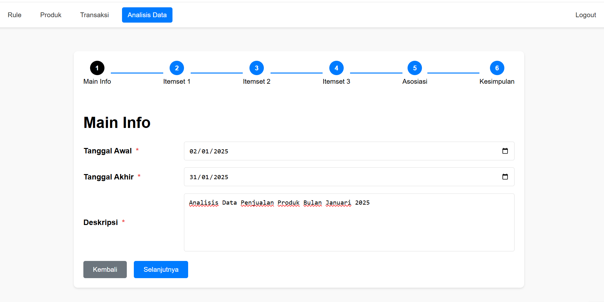
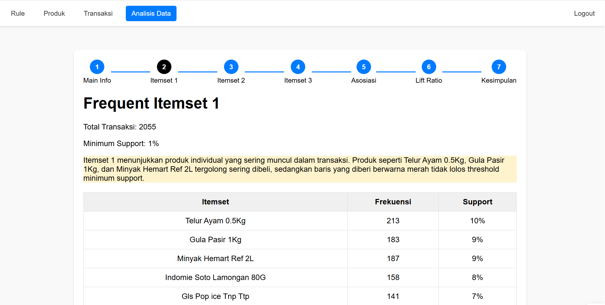
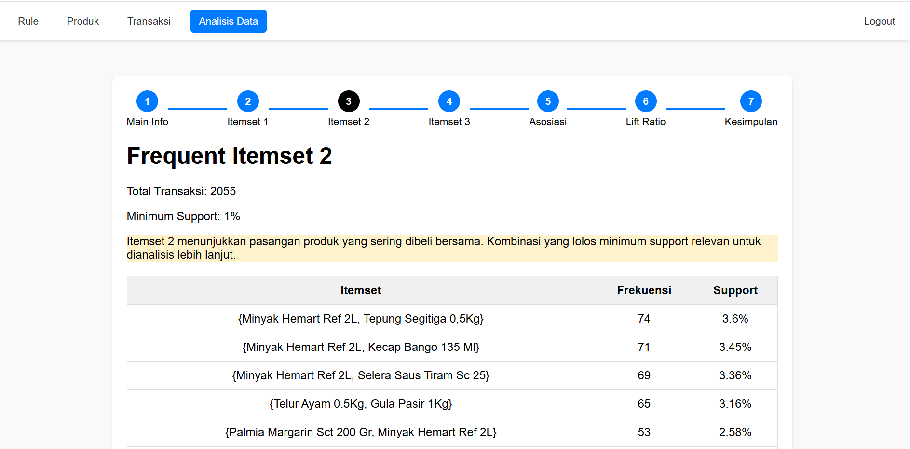
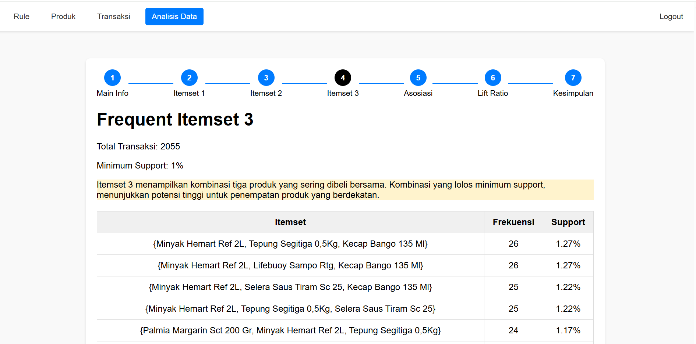
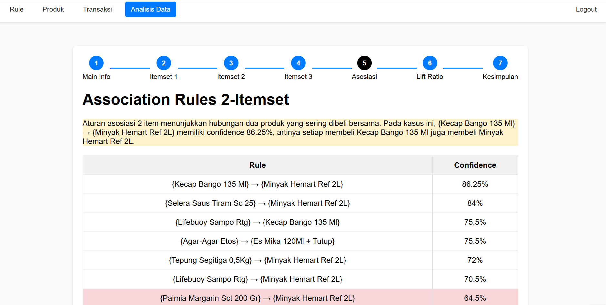
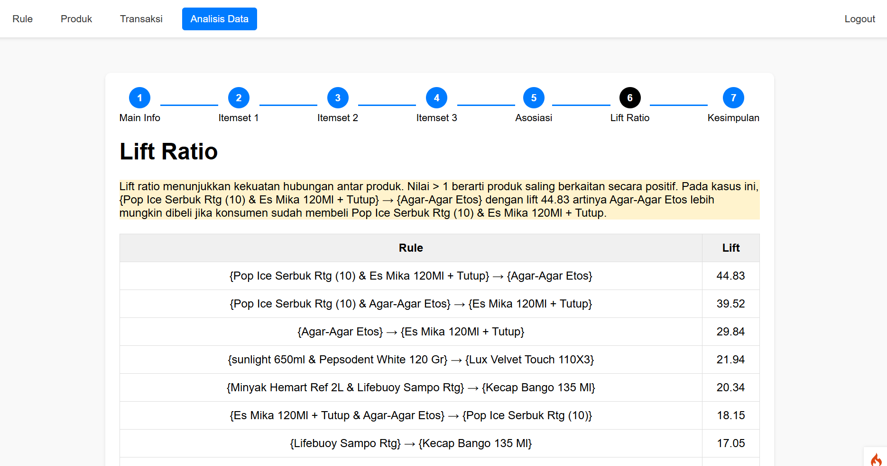
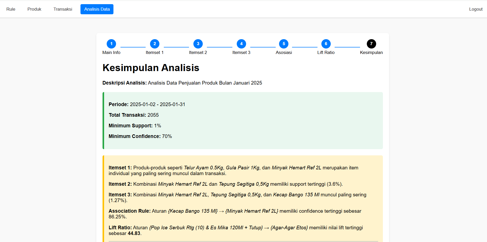

# Description

A platform for product sales data analysis through the implementation of the Apriori algorithm.

## 📁 Directory Structure

Here is the main directory structure of the project:

```
analisis-penjualan/
├── app/                   # Application code
├── public/                # Public assets (images, CSS, JS)
├── tests/                 # Unit tests
├── writable/              # Directory for writable files
├── .gitignore             # List of files and directories ignored by Git
├── LICENSE                # Project license
├── README.md              # Project documentation
├── composer.json          # PHP dependencies
└── env                    # Environment variables
```

## ⚙️ Installation

To run this project locally, follow these steps:

1. **Clone the repository:**

   ```bash
   git clone https://github.com/UmmuIzzatulWidyatama/analisis-penjualan.git
   cd analisis-penjualan
   ```

2. **Install dependencies:**

   ```bash
   composer install
   ```

3. **Copy the `.env.example` file to `.env` and configure the database settings:**

   ```bash
   cp .env.example .env
   ```

4. **Run database migrations and seeders (if needed):**

   ```bash
   php spark migrate
   php spark db:seed
   ```

5. **Start the development server:**

   ```bash
   php spark serve
   ```

The application can now be accessed at [http://localhost:8080](http://localhost:8080).

## 🧪 Testing

To run unit tests, use the following command:

```bash
php spark test
```

## 📈 Key Features

- **Sales Trend Analysis:** Identify seasonal patterns and long-term trends in sales data.
- **Customer Segmentation:** Group customers based on purchasing behavior for more targeted marketing strategies.
- **Data Visualization:** Use charts and graphs to make data understanding and presentation easier.
- **Sales Prediction:** Implement predictive models to forecast future sales.

## 📚 Technologies Used

- **Backend:** PHP with CodeIgniter 4
- **Database:** MySQL
- **Frontend:** HTML, CSS, JavaScript
- **Visualization:** Chart.js, D3.js
- **Data Analysis:** PHP and SQL

# Analisis Penjualan

## Main Info


## Itemset 1


## Itemset 2


## Itemset 3


## Asosiasi 2 Itemset


## Lift Ratio


## Kesimpulan

